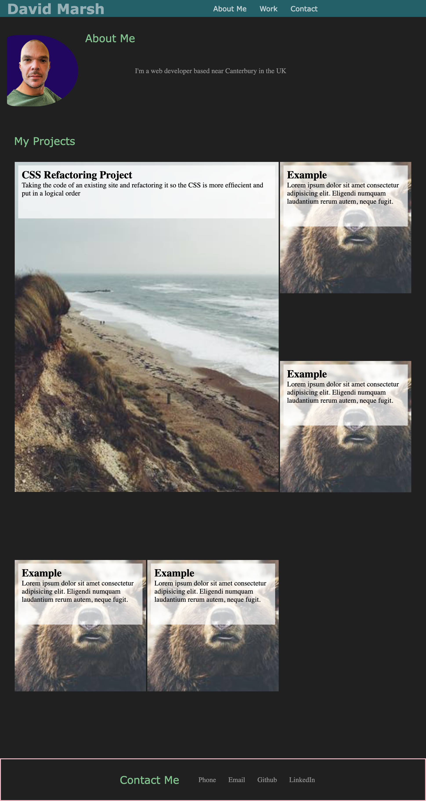

# portfolio

## https://daveym1.github.io/portfolio/

This is my portfolio. It's an ongoing project which I'll add to as I improve my skills and work on more projects.

The portfolio uses CSS flex box and grid to align items on the page. I'm also using media queries to make the page responsive for smaller screen sizes.

Below is a screenshot of the current page:

